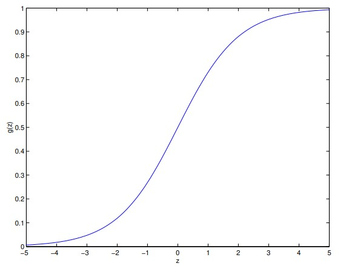

# Classification and Logistic Regression
A classification problem is just like a regression problem, except that the values y we now want to predict take on only a small number of discrete values. Let us focus on __binary classification__ problem in which y can take on only two values, 0 and 1. (Most of what we say here will also generalize to the multiple-class case.) For instance, if we are trying to build a spam classifier for email, then $x^{(i)}$ may be some feature (a word) of a piece of email, and y may be 1 if it is a piece of spam mail and 0 otherwise.
## Logistic Regression
We could approach the classification problem ignoring that y is discrete-valued, but it does not make sense for $h_\theta(x)$ to take values larger than 1 or smaller than 0 when we know that $y \isin \{0, 1\}$.
To fix this, let's change the hypotheses $h_\theta(x)$:
```math
g(\theta^Tx) = \frac{1}{1 + e^{-\theta^Tx}}
```
It is called the __logistic function__ or the __sigmoid function__:



After taking the derivative of this function and making multiple assumptions, we get the stochastic gradient ascent rule:
```math
\theta_j := \theta_j + \alpha(y^{(i)} - h_\theta(x^{(i)}))x_j^{(i)}
```
If we compare this to the LMS update rule, we see that it looks identical; but this is not the same algorithm, because $h_\theta(x^{(i)})$ is now defined as a non-linear function of $\theta^Tx^{(i)}$.
## Digression: the perceptron learning algorithm
Consider modifying the logistic regression method to "force" it to output values that are either 0 or 1 or exactly. To do so it seems natural to change the definition of g to be the threshold function:
```math
x = \begin{cases} 1 & \text{if } z \ge 0 \\ 0 &\text{if } z < 0 \end{cases}
```
If we then let $h_\theta(x) = g(\theta^Tx)$ using this modified definition of $g$, and we use the update rule
```math
\theta_j := \theta_j + \alpha(y^{(i)} - h_\theta(x^{(i)}))x_j^{(i)}
```
then we have the __perceptron learning algorithm__.
