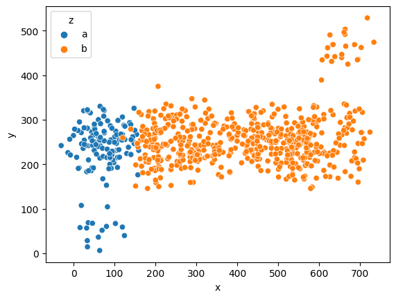
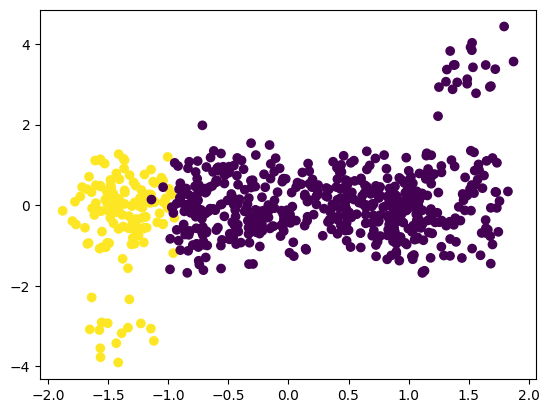
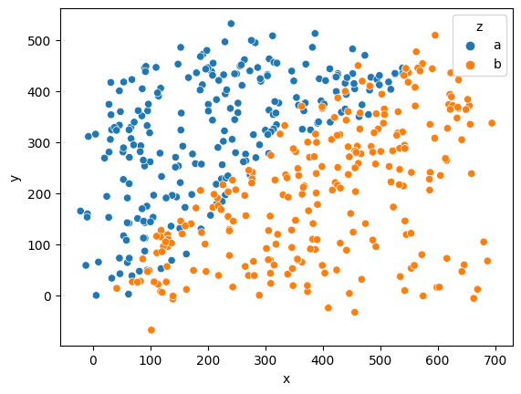
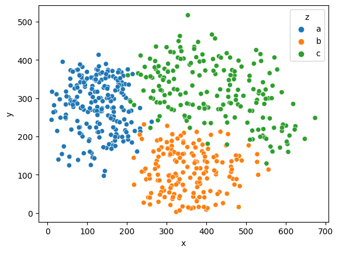
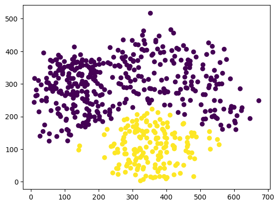

# Масштабирование
___
## Standard Scaler
```Python
X = df2[["x", "y"]].values
y = df2["z"] == "a"
sns.scatterplot(data=df2, x="x", y="y", hue="z")
```



```Python
X_new = StandardScaler().fit_transform(X)
plt.scatter(X_new[:, 0], X_new[:, 1], c=y)
```


___

## Quantile Transformer
Так как Standard Scaler сработал не так эффективно, я решил применить Quantile Transformer, который позволяет анализировать "выбросы" (данные, которые существенно отличаются от отсальных)
```Python
X_new1 = QuantileTransformer().fit_transform(X)
plt.scatter(X_new1[:, 0], X_new1[:, 1], c=y)
```
В результате распределение данных становится более читаемым.

___

## Standard Scaler (удачный пример)

```Python
sns.scatterplot(data=df, x = "x", y = "y", hue="z")
```



```Python
X = df[["x", "y"]].values
y = df["z"] == "b"

from sklearn.preprocessing import StandardScaler

X_new = StandardScaler().fit_transform(X)

plt.scatter(X_new[:, 0], X_new[:, 1], c=y)
```
На изображении видно, что значения по осям __x__ и __y__ одинаковые.

___

## Polynomial Features

Для анализа сложных данных можеть помочь preprocessor PolynomialFeatures. Он хорошо работает, когда данные сложно, либо нельзся разделить простой линией.

```Python
sns.scatterplot(data=df4, x="x", y="y", hue="z")
```



```Python
X = df4[["x", "y"]].values
y = df4["z"] == "b"

pipe = Pipeline([
    ('scale', PolynomialFeatures(degree=2)),
    ('model', LogisticRegression())
])

pred = pipe.fit(X, y).predict(X)

plt.scatter(X[:, 0], X[:, 1], c=pred)
```
В данном случае я использовал degree=2, что означает применение квадратной линии [1, a, b, a^2, ab, b^2].
