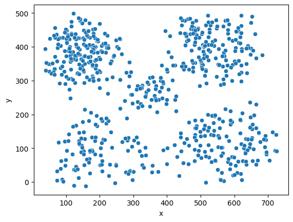
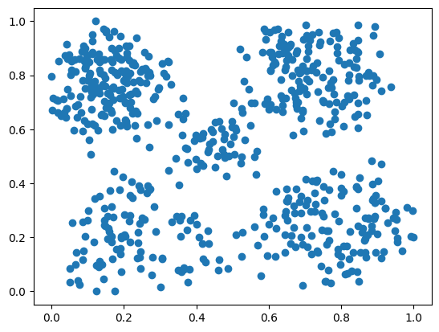
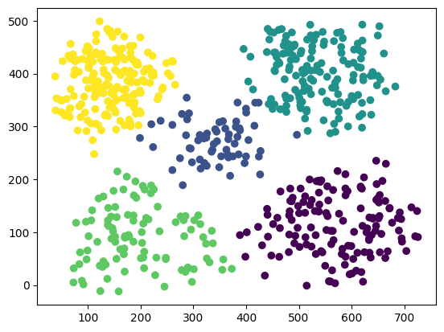

# Clustering
___
# K-means Clustering
```Python
sns.scatterplot(data=df, x="x", y="y")
```


Scaling:
```Python
scaler = MinMaxScaler()
df.drop('z', axis=1, inplace=True)
data = np.array(scaler.fit_transform(df))
plt.scatter(data[:, 0], data[:, 1])
```


```Python
model = KMeans(n_clusters=5, n_init=20, max_iter=300, random_state=0)
y_pred = model.fit(data)
df['Cluster'] = y_pred.labels_

data = np.array(df)

x_min, x_max = data[:, 0].min() - 1, data[:, 0].max() + 1
y_min, y_max = data[:, 1].min() - 1, data[:, 1].max() + 1

sample_size = 1000 
sampled_data = data[np.random.choice(data.shape[0], sample_size, replace=False)]

xx, yy = np.meshgrid(np.arange(x_min, x_max, 0.1), np.arange(y_min, y_max, 0.1))
Z = model.predict(np.c_[xx.ravel(), yy.ravel()])
Z = Z.reshape(xx.shape)

plt.scatter(data[:, 0], data[:, 1], c=df.Cluster.values, cmap='viridis', label='Data Points')
```
