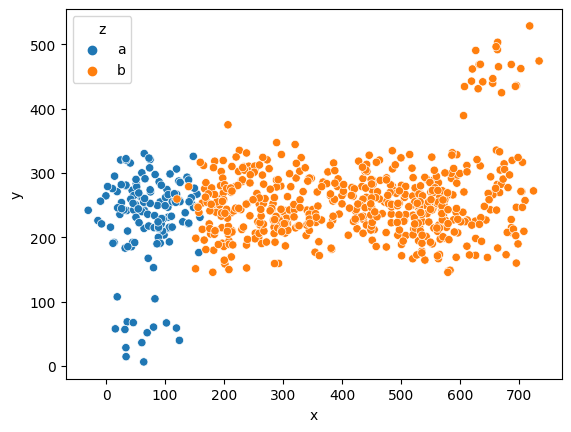
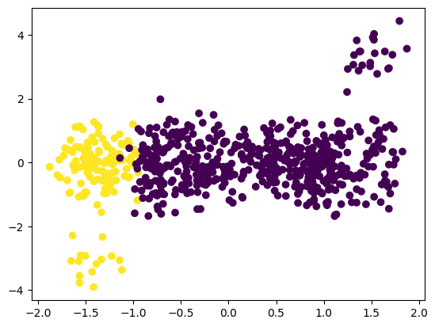
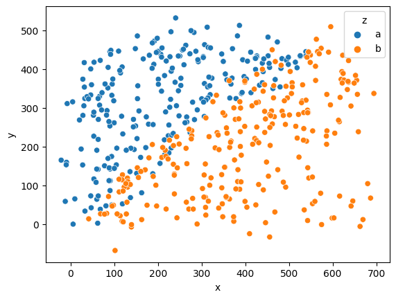
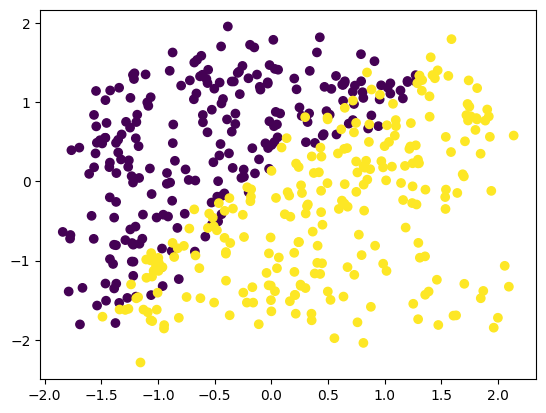
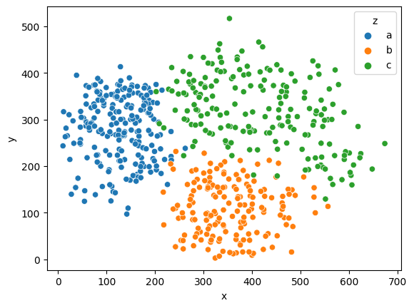
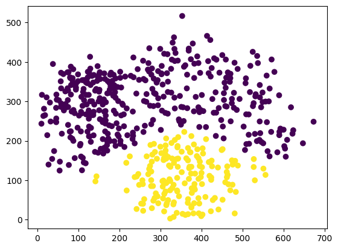

# Scaling
___
## Standard Scaler
```Python
X = df2[["x", "y"]].values
y = df2["z"] == "a"
sns.scatterplot(data=df2, x="x", y="y", hue="z")
```



```Python
X_new = StandardScaler().fit_transform(X)
plt.scatter(X_new[:, 0], X_new[:, 1], c=y)
```


___

## Quantile Transformer
As the Standard Scaler didn't work as effectively, I decided to use the Quantile Transformer, which allows the analysis of outliers (data points that significantly differ from the rest).

```Python
X_new1 = QuantileTransformer().fit_transform(X)
plt.scatter(X_new1[:, 0], X_new1[:, 1], c=y)
```
As a result, the distribution of the data becomes more interpretable.

___

## Standard Scaler Example 1

```Python
sns.scatterplot(data=df, x = "x", y = "y", hue="z")
```



```Python
X = df[["x", "y"]].values
y = df["z"] == "b"

from sklearn.preprocessing import StandardScaler

X_new = StandardScaler().fit_transform(X)

plt.scatter(X_new[:, 0], X_new[:, 1], c=y)
```
The image shows that the values on the __x__ and __y__ axes are identical.

___

## Polynomial Features

The PolynomialFeatures preprocessor can be helpful in analyzing complex data. It works well when the data is complex or cannot be separated by a simple linear boundary.

```Python
sns.scatterplot(data=df4, x="x", y="y", hue="z")
```



```Python
X = df4[["x", "y"]].values
y = df4["z"] == "b"

pipe = Pipeline([
    ('scale', PolynomialFeatures(degree=2)),
    ('model', LogisticRegression())
])

pred = pipe.fit(X, y).predict(X)

plt.scatter(X[:, 0], X[:, 1], c=pred)
```
In this case, I used degree=2, which means applying a quadratic line [1, a, b, a^2, ab, b^2].

