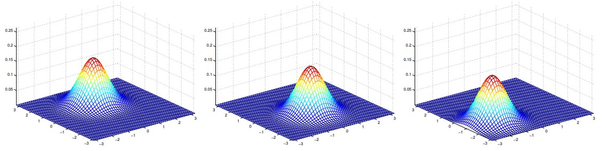

# Generative learning algorithms
Consider a classification problem in which we want to learn to distinguish between elephants $(y = 1)$ and dogs $(y = 0)$, based on some features of an animal. Given a training set, an algorithm (basically) tries to find a straight line - that is, a decision boundary - that separates the elephants and dogs. Then, to classify a new animal as either an elephant or a dog, it checks on which side of the decision boundary it falls, and makes its prediction accordingly.
Here's a different approach. First, looking at elephants we can build a model of what elephants look like. Then, looking at dogs, we can build a separate model of what dogs look like. Finally, to classify a new animal, we can match the new animal against the elephant model, and match it against the dog model, to see whether the new animal looks more like the elephants or dogs we had seen in the training set.
Algorithms that try to learn $p(y|x)$ directly (such as logistic regression), or algorithms that try to learn mappings directly from the space of inputs $\chi$ to the labels {1, 0}, (such as the perceptron algorithm) are called __discriminative__ learning algorithms. Here, we'll talk about algorithms that instead try to model $p(x|y)$ (and p(y)). These algorithms are called __generative__ learning algorithms. For instance, if y indicates whether an example is a dog (0) or an elephant (1), then $p(x|y=0)$ models the distribution of dogs' features, and $p(x|y=1)$ models the distribution of elephants' features.
## Gaussian discriminant analysis (GDA)
In this model, we will assume that $p(x|y)$ is distributed according to a multivariate normal distribution. Let's talk about the properties of multivariate normal distribution before moving on to the GDA model itself.
### The multivariate normal distribution
The multivariate normal distribution in d-dimensions, also called the multivariate Gaussian distribution, is parameterized by a __mean vector__ $\mu \in \R^d$ and a __covariance matrix__ $\varSigma \in \R^{d\times d}$, where $\varSigma\ge 0$ is symmetric and positive semi-definite.
Here are some examples of what the density of a Gaussian distribution looks like:


The left-most figure shows a Gaussian with mean zero (that is, the 2x1 zero-vector) and covariance matrix $\varSigma = I$ (the 2x2 identity matrix). A Gaussian with zero mean and identity covariance is also called the __standard normal distribution__. The middle figure shows the density of a Gaussian with zero mean and $\varSigma = 0.6I$; and the rightmost figure shows one with, $\varSigma = 2I$. We see that as $\varSigma$ becomes larger, the Gaussian becomes more "spread-out", and as it becomes smaller, the distribution becomes more "compressed".
Let's look at some more examples.


The figures above show Gaussians with mean 0 and with covariance matrices respectively
```math
\varSigma = \begin{bmatrix} 1 & 0 \\ 0 & 1 \end{bmatrix}, \varSigma = \begin{bmatrix} 1 & 0.5 \\ 0.5 & 1 \end{bmatrix}, \varSigma = \begin{bmatrix} 1 & 0.8 \\ 0.8 & 1 \end{bmatrix}
```
The leftmost figure shows the familiar standard normal distribution, and we see that as we increase the off-diagonal entry in $\varSigma$, the density becomes more "compressed" towards the 45-degree line (given by $x_1 = x_2$). We can see this more clearly when we look at the contours of the same three densities:


In the last set of examples, fixing $\varSigma = I$, by varying $\mu$, we can also move the mean of the density around.



The figures above were generated using $\varSigma = I$, and respectively
```math
\mu = \begin{bmatrix} 1 \\ 0 \end{bmatrix}; \mu = \begin{bmatrix} -0.5 \\ 0 \end{bmatrix}; \mu = \begin{bmatrix} -1 \\ -1.5 \end{bmatrix}
```
### The Gaussian discriminant analysis model
When we have a classification problem in which the input features $x$ are continuous-valued random variables, we can then use the Gaussian Discriminant Analysis (GDA) model, which models $p(x|y)$ using a multivariate normal distribution.
```math
\varSigma = \frac{1}{n}\sum_{i=1}^n(x^{(i)} - \mu_{y^{(i)}})(x^{(i)} - \mu_{y^{(i)}})^T
```
Pictorially, what the algorithm is doing can be seen as follows:


Shown in the figure are the training set, as well as the contours of the two Gaussian distributions that have been fit to the data in each of the two classes. Note that the two Gaussians have contours that are the same shape and orientation since they share a covariance matrix $\varSigma$, but they have different means $\mu_0$ and $\mu_1$. Also, shown in the figure is the straight line giving the decision boundary at which $p(y=1|x) = 0.5$. On the one side of the boundary, we'll predict $y=1$ to be the most likely outcome, and on the other side, we'll predict $y=0$.
### Discussion: GDA and logistic regression
GDA and logistic regression will, in general, give different decision boundaries when trained on the same dataset. Which is better?
If $p(x|y)$ is multivariate Gaussian (with shared $\varSigma$), then $p(y|x)$ necessarily follows a logistic function. The converse, however, is not true; i.e., $p(y|x)$ being a logistic function does not imply $p(x|y)$ is multivariate Gaussian. This shows that GDA makes _stronger_ modeling assumptions about the data than does logistic regression. It turns out that when these modeling assumptions are correct, then GDA will find better fits to the data, and is a better model. Specifically, when $p(x|y)$ is indeed gaussian (with shared $\varSigma$), then GDA is __asymptotically efficient__. Informally, this means that in the limit of very large training sets (large $n$), there is no algorithm that is strictly better than GDA (in terms of, say, how accurately they estimate p(y|x)). In particular, it can be shown that in this setting, GDA will be a better algorithm than logistic regression; and more generally, even for small training set sizes, we would generally expect GDA to be better.
In contrast, by making significantly weaker assumptions, logistic regression is also _robust_ and less sensitive to incorrect modeling assumptions. There are many different sets of assumptions that would lead to $p(y|x)$ taking the form of a logistic function. For example, if $x|y = 0 \sim$ Poisson($\lambda_0$), and $x|y = 1 \sim$ Poisson($\lambda_1$), then $p(y|x)$ will be logistic. Logistic regression will also work well on Poisson data like this. But if we were to use GDA on such data—and fit Gaussian distributions to such non-Gaussian data—then the results would be less predictable, and GDA may (or may not) do well.
To summarize: GDA makes stronger modeling assumptions and is more data efficient (i.e., requires less training data to learn "well") when the modeling assumptions are correct or at least approximately correct. Logistic regression makes weaker assumptions and is significantly more robust to deviations from modeling assumptions. Specifically, when the data is indeed nonGaussian, then in the limit of large datasets, logistic regression will almost always do better than GDA. For this reason, in practice logistic regression is used more often than GDA.
## Naive bayes
In GDA, the feature vectors $x$ were continuous, real-valued vectors. Let's now talk about a different learning algorithm in which the $x_j$'s are discrete-valued.
Consider building an email spam filter using machine learning. We will represent an email via a feature vector whose length is equal to the number of words in the dictionary. Specifically, if an email contains the j-th word of the dictionary, then we will set $x_j = 1$; otherwise, we let $x_j = 0$.
Havin chosen our feature vector, we now want to build a generative model. So, we have to model $p(x|y)$. But if we have, say, a vocabulary of 50000 words, then $x \in \{0,1\}^{50000}$ ($x$ is a 50000-dimensional vector of 0's and 1's), and if we were to model $x$ explicitly with a multinomial distribution over the $2^{50000}$ possible outcomes, then we'd end up with $(2^{50000} - 1)$-dimensional parameter vector. This is clearly too many parameters.
To model $p(x|y)$, we will therefore make a very strong assumption. We will assume that the $x_i$'s are conditionally independent given $y$. This assumption is called __Naive Bayes (NB) assumption__, and the resulting algorithm is called the __Naive Bayes classifier__.