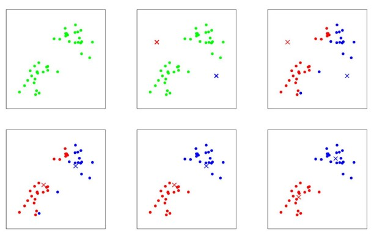

## Clustering and the k-means algorithm
____
In the clustering problem, we are given a training set ${x^{(1)},...,x^{(n)}}$, and want to group the data into a few cohesive "clusters". Here, $x^{(i)} \in R^d$ as usual; but no labels $y^{(i)}$ are given. So, this is an usupervised learning problem.
The k-means clustering algorithm is as follows:

1. Initialize __cluster centroids__ $\mu_1, \mu_2,..., \mu_k \in R^d$ randomly.
2. Repeat until convergence: {
    For every $i$, set
   
```math
c^{(i)} := arg min||x^{(i)} - \mu_j||^2
```
For each $j$, set
```math
\mu_j := \frac{\textstyle\sum_{i=1}^n 1 \{c^{(i)}=j\}x^{(i)}}{\textstyle\sum_{i=1}^n 1 \{c^{(i)}=j\}}
```
}

In the algorithm above, $k$ (a parameter of the algorithm) is the number of clusters we want to find; and the cluster centroids $\mu_j$ represent our current guesses for the positions of the centers of the clusters. To initialize the cluster centroids (in step 1 of the algorithm above), we could choose $k$ training examples randomly, and set the cluster centroids to be equal to the values of the $k$ examples. (Other initialization methods are also possible)

The inner-loop of the algorithm repeatedly carries out two steps: (i) "Assigning" each training example $x^{(i)}$ to the closest cluster centroid $\mu_j$, and moving each cluster centroid $\mu_j$ to the mean of the points assigned to it. The figure shows an illustration of running k-means.



Is the k-means algorithm guaranteed to converge? Yes it is, in a certain sense. In particular, let us define the __distortion function__ to be:

```math
J(c, \mu) = \sum_{i=1}^n||x^{(i)}-\mu_{c^{(i)}}||^2
```

Thus, $J$ measures the sum of squared distances between each training example $x^{(i)}$ and the cluster centroid $\mu_{c^{(i)}}$ to which it has been assigned. It can be shown that k-means is exactly coordinate descent on $J$. Specifically, the inner-loop of k-means repeatedly minimizes $J$ with respect to $c$ while holding $\mu$ fixed, and them minimizes $J$ with respect to $\mu$ while holding $c$ fixed. Thus, $J$ must monotonically decrease, and the value of $J$ must converge. (Usually, this implies that $c$ and $\mu$ will converge too. In theory, it is possible for k-means to oscillate between a few different clusterings - i.e., a few different values for $c$ and/or $\mu$ - that have exactly the same value of $J$, but this almost never happens in practice.)

The distortion function $J$ is a non-convex function, and so coordinate descent on $J$ is not guaranteed to converge to the global minimum. In other words, k-means can be susceptible to local optima. Very often k-means will work fine and come up with very good clusterings despite this. But if you are worried about getting stuck in bad local minima, one common thing to do is run k-means many times (using different random initial values for the cluster centroids $\mu_j$). Then, out of all the different clusterings found, pick the one that gives the lowest distortion $J(c,\mu)$
