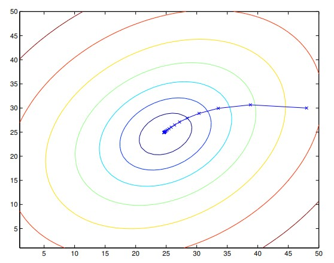
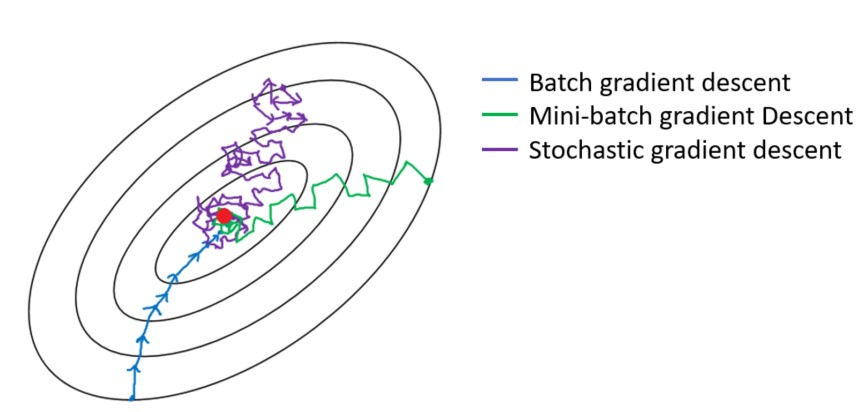

# Linear Regression
## LMS algorithm
```math
\theta_j := \theta_j - \alpha \frac{\partial}{\partial\theta_j}J(\theta)
```
$\alpha$ is called the __learning rate__, $\theta$ is the __parameter__ (also called __weight__) parameterizing the space of linear functions mapping from x to y. This is very natural algorithm that repeatedly takes a step in the direction of steepest decrease of J.
For a single training example, this gives the update rule:
$$
\theta_j := \theta_j + \alpha (y^{(i)} - h_\theta (x^{(i)}))x_j ^{(i)}
$$
The rule is called the __LMS__ update rule (LMS stands for _least mean squares_), and is also known as the __Widrow_holf__ learning rule. The magnitude of the update is proportional to the __error__ term $(y^{(i)} - h_\theta (x^{(i)}))$; thus, for instance, if we are encountering a training example on which our prediction nearly matches the actual value of $y^{(i)}$, then we find that there is little need to change the parameters; in contrast, a larger change to the parameters will be made if our prediction $h_\theta (x^{(i)})$ has a large error (i.e., if it is very far from $y^{(i)}$).
To modify the method for a training set of more than one example:
$$
\theta := \theta + \alpha \sum_{i=1}^n(y^{(i)} - h_\theta(x^{(i)}))x^{(i)}
$$
This method looks at every example in the training set on every step, and is called __batch gradient descent__. Here is an example of gradient descent as it is run to minimize a quadratic function.

There is an alternative to batch hradient descent that also works very well. The algorith is called __stochastic gradient descent__ (also __incremental gradient descent__):
$$
\theta := \theta + \alpha(y^{(i)}-h_\theta(x^{(i)}))x^{(i)}
$$
In this algorithm, we repeatedly run through the training set, and each time we encounter a training example, we update the parameters according to the gradient of the error with respect to that single training example only. Whereas batch gradient descent has to scan through the entire training set before taking a single step—a costly operation if n is large—stochastic gradient descent can start making progress right away, and continues to make progress with each example it looks at. Often, stochastic gradient descent gets $\theta$ "close" to the minimum much faster than batch gradient descent. (Note however that it may never "converge" to the minimum, and the parameters $\theta$ will keep oscillating around the minimum of J($\theta$)). For these reasons, __particularly when the training set is large, stochastic gradient descent is often preferred over batch gradient descent__.

