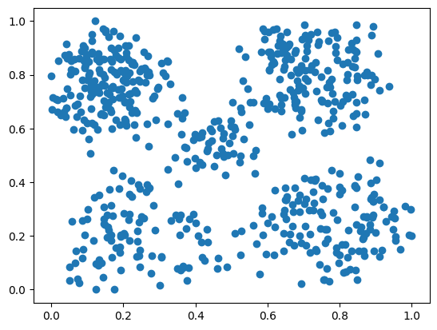

# Дерево решений (Decision Trees)
Preprocessing:
```Python
X = heart_data.drop(["Height_(cm)", "Weight_(kg)", "Heart_Disease"], axis=1)
y = heart_data["Heart_Disease"]

categorical_columns = ["General_Health", "Checkup", "Exercise", "Skin_Cancer",
                       "Other_Cancer", "Depression", "Diabetes", "Arthritis", "Sex", "Age_Category", "Smoking_History"]
numerical_columns = X.columns.difference(categorical_columns)
```
Pipelines and prediction:
```Python
def get_mae(max_leaf_nodes, X_train, X_test, y_train, y_test):

    preprocessor = ColumnTransformer(transformers=[
        ('onehot', OneHotEncoder(handle_unknown='ignore'), categorical_columns),
        ('num', 'passthrough', numerical_columns)
    ])

    pipe = Pipeline([
        ('preprocessor', preprocessor),
        ('scaler', StandardScaler()),
        ('model', DecisionTreeClassifier(max_leaf_nodes=max_leaf_nodes, random_state=0))
    ])

    pred = pipe.fit(X_train, y_train).predict(X_test)
    return pred

X_train, X_test, y_train, y_test = train_test_split(X, y, random_state=0, train_size=0.9)

for max_leaf_nodes in [5, 50, 500, 5000]:
    my_mae = get_mae(max_leaf_nodes, X_train, X_test, y_train, y_test)
    accuracy = accuracy_score(y_test, my_mae)
    print(f"Accuracy: {accuracy:.6f}")
```
___Accuracy__: _0.919316_
___Accuracy__: _0.918992_
___Accuracy__: _0.916532_
___Accuracy__: _0.907175_

# Случайный лес (Random forest)
```Python
from sklearn.ensemble import RandomForestClassifier

preprocessor = ColumnTransformer(transformers=[
    ('num', 'passthrough', numerical_columns),
    ('cat', OneHotEncoder(handle_unknown='ignore'), categorical_columns)
])

pipeline = Pipeline([
    ('preprocessor', preprocessor),
    ('model', RandomForestClassifier(random_state=0))
])

y_pred = pipeline.fit(X_train, y_train).predict(X_test)

rf_accuracy = accuracy_score(y_test, y_pred)
print(f"Random Fores accuracy: {rf_accuracy: .6f}")
```
__Accuracy__: _0.915949_
# Градиентный бустинг (Gradient Boosting)
```Python
from sklearn.ensemble import GradientBoostingClassifier

pipeline = Pipeline([
    ('preprocessor', preprocessor),
    ('model', GradientBoostingClassifier(n_estimators=200, learning_rate=0.1, random_state=0))
])

y_pred = pipeline.fit(X_train, y_train).predict(X_test)

gb_accuracy = accuracy_score(y_test, y_pred)
print(f"Gradient Boosting accuracy: {gb_accuracy:.6f}")
```
__Accuracy__: _0.918636_
# K-ближайших соседей (K-neighbors classifier)
```Python
preprocessor = ColumnTransformer(transformers=[
    ('num', 'passthrough', numerical_columns),
    ('cat', OneHotEncoder(handle_unknown='ignore'), categorical_columns)
])

pipe = Pipeline([
    ('preprocessor', preprocessor),
    ('scaler', PolynomialFeatures()),
    ('model', KNeighborsClassifier(n_neighbors=10))
])

X_train, X_test, y_train, y_test = train_test_split(X, y, random_state=0, test_size=0.9)

y_pred = pipe.fit(X_train, y_train).predict(X_test)

accuracy = accuracy_score(y_test, y_pred)
print(f"Accuracy: {accuracy:.6f}")
```
__Accuracy__: _0.918962_

# Логистическая регрессия (Logistic Regression)

```Python
categorical_tranformer = Pipeline([
    ('onehot', OneHotEncoder(handle_unknown='ignore'))
])

preprocessor = ColumnTransformer(transformers=[
    ('num', 'passthrough', numerical_columns),
    ('cat', categorical_tranformer, categorical_columns)
])

pipe = Pipeline([
    ('preprocessor', preprocessor),
    ('scaler', StandardScaler()),
    ('model', LogisticRegression(max_iter=1000))
])

X_train, X_test, y_train, y_test = train_test_split(X, y, random_state=0, train_size=0.90)

pred = pipe.fit(X_train, y_train).predict(X_test)
```
__Accuracy__: _0.918798_

# Наивный байесовский классификатор (Naive Bayes)
__Bernoully__:
```Python
preprocessor = ColumnTransformer(transformers=[
    ('num', 'passthrough', numerical_columns),
    ('cat', OneHotEncoder(handle_unknown='ignore'), categorical_columns)
])

pipeline = Pipeline([
    ('preprocessor', preprocessor),
    ('model', BernoulliNB())
])
```
__Accuracy__: _0.845041_

__Gaussian__:

```Python
preprocessor = ColumnTransformer(transformers=[
    ('num', 'passthrough', numerical_columns),
    ('cat', OneHotEncoder(handle_unknown='ignore'), categorical_columns)
])

pipeline = Pipeline([
    ('preprocessor', preprocessor),
    ('model', GaussianNB())
])
```
__Accuracy__: _0.641088_

__Multinomial__:
```Python
preprocessor = ColumnTransformer(transformers=[
    ('num', 'passthrough', numerical_columns),
    ('cat', OneHotEncoder(handle_unknown='ignore'), categorical_columns)
])

pipeline = Pipeline([
    ('preprocessor', preprocessor),
    ('model', MultinomialNB())
])
```
__Accuracy__: _0.843267_

__Complement__:
```Python
preprocessor = ColumnTransformer(transformers=[
    ('num', 'passthrough', numerical_columns),
    ('cat', OneHotEncoder(handle_unknown='ignore'), categorical_columns)
])

pipeline = Pipeline([
    ('preprocessor', preprocessor),
    ('model', ComplementNB())
])
```
__Accuracy__: _0.686132_

# Метод опорных векторов (SVM)
```Python
preprocessor = ColumnTransformer(transformers=[
    ('num', 'passthrough', numerical_columns),
    ('cat', OneHotEncoder(handle_unknown=('ignore')), categorical_columns)
])

pipe = Pipeline([
    ('preprocessor', preprocessor),
    ('nystroem', Nystroem(kernel='rbf', n_components=100, random_state=0)),
    ('model', SGDClassifier())
])
```
# Clustering
# Кластеризация k-средних (k-means Clustering)
```Python
sns.scatterplot(data=df, x="x", y="y")
```


Scaling:
```Python
scaler = MinMaxScaler()
df.drop('z', axis=1, inplace=True)
data = np.array(scaler.fit_transform(df))
plt.scatter(data[:, 0], data[:, 1])
```


```Python
model = KMeans(n_clusters=5, n_init=20, max_iter=300, random_state=0)
y_pred = model.fit(data)
df['Cluster'] = y_pred.labels_

data = np.array(df)

x_min, x_max = data[:, 0].min() - 1, data[:, 0].max() + 1
y_min, y_max = data[:, 1].min() - 1, data[:, 1].max() + 1

sample_size = 1000 
sampled_data = data[np.random.choice(data.shape[0], sample_size, replace=False)]

xx, yy = np.meshgrid(np.arange(x_min, x_max, 0.1), np.arange(y_min, y_max, 0.1))
Z = model.predict(np.c_[xx.ravel(), yy.ravel()])
Z = Z.reshape(xx.shape)

plt.scatter(data[:, 0], data[:, 1], c=df.Cluster.values, cmap='viridis', label='Data Points')
```


# Линейная регрессия (Linear Regression)

## Preprocessing
```Python
melb_data["Date"] = pd.to_datetime(melb_data["Date"], format="%d/%m/%Y")
melb_data["Date"] = melb_data["Date"].dt.year
```
Missing values:

|car|62|
|___|___|
|BuildingArea|6450|
|YearBuilt|5375|
|CouncilArea|1369|

The number of unique categorical variables:
```Python
melb_data.select_dtypes(['object']).nunique()
```

|Suburb|314|
|Address|13378|
|Type|3|
|Method|5|
|SellerG|268|
|CouncilArea|33|
|regionname|8|

```Python
melb_data.dropna(axis=0, inplace=True)

X = melb_data.drop(["Price", "Suburb", "Address", "SellerG", "CouncilArea"], axis=1)
y = melb_data["Price"]

print(X.shape)

categorical_val = ["Type", "Method", "Regionname"]
numerical_val = X.columns.difference(categorical_val)

categorical_transformer = Pipeline([
    ('onehot', OneHotEncoder(handle_unknown='ignore'))
])

preprocessor = ColumnTransformer(
    transformers=[
        ('num', 'passthrough', numerical_val),
        ('cat', categorical_transformer, categorical_val)
    ]
)

pipe = Pipeline([
    ('preprocessor', preprocessor),
    ('model', LinearRegression())
])

train_X, test_X, train_y, test_y = train_test_split(X, y, random_state=0)

pred = pipe.fit(train_X, train_y).predict(test_X)
```
```Python
absolute_percentage_error = np.abs((test_y - pred) / test_y) * 100

mape = np.mean(absolute_percentage_error)
```
__27.934158203951704__

## Approach 2

I will use machine learning imputation, which means I will predict missing values of __building_area__ and then use it to predict prices.

```Python
relevant_features = ["Rooms", "Type", "Bedroom2", "Distance", "Postcode", "Bathroom", "Car", "Landsize", "Regionname"]
X_train = melb_data.loc[~melb_data["BuildingArea"].isnull(), relevant_features]
y_train = melb_data.loc[~melb_data["BuildingArea"].isnull(), "BuildingArea"]

X_missing = melb_data.loc[melb_data["BuildingArea"].isnull(), relevant_features]

pipe = Pipeline([
    ('onehot', OneHotEncoder(handle_unknown='ignore')),
    ('model', LinearRegression())
])

y_missing_pred = pipe.fit(X_train, y_train).predict(X_missing)

# Now let's fill in the missing values in the original DataFrame
melb_data.loc[melb_data["BuildingArea"].isnull(), "BuildingArea"] = y_missing_pred
```
For missing values of the __YearBuilt__ feature I will apply the same method:

```Python
relevant_features = ["Rooms", "Method", "Distance", "Postcode", "Bedroom2", "Bathroom", "Car", "Landsize", "BuildingArea", "Regionname"]

X_train = melb_data.loc[~melb_data["YearBuilt"].isnull(), relevant_features]
y_train = melb_data.loc[~melb_data["YearBuilt"].isnull(), "YearBuilt"]

X_missing = melb_data.loc[melb_data["YearBuilt"].isnull(), relevant_features]

pipe = Pipeline([
    ('onehot', OneHotEncoder(handle_unknown='ignore')),
    ('model', LinearRegression())
])

y_missing_pred = pipe.fit(X_train, y_train).predict(X_missing)

melb_data.loc[melb_data["YearBuilt"].isnull(), "YearBuilt"] = y_missing_pred
```
```Python
melb_data = melb_data.dropna(subset=["Car"])

X = melb_data.drop(["Price", "Suburb", "Address", "SellerG", "CouncilArea"], axis=1)
y = melb_data["Price"]

print(X.shape)

categorical_cols = ["Type", "Method", "Regionname"]
numerical_cols = X.columns.difference(categorical_cols)

categorical_transformer = Pipeline([
    ('onehot', OneHotEncoder(handle_unknown='ignore'))
])

preprocessor = ColumnTransformer(
    transformers=[
        ('num', 'passthrough', numerical_cols),
        ('cat', categorical_transformer, categorical_cols)
    ]
)

pipe = Pipeline([
    ('preprocessor', preprocessor),
    ('model', LinearRegression())
])

X_train, X_test, y_train, y_test = train_test_split(X, y, random_state=0)

pred = pipe.fit(X_train, y_train).predict(X_test)

# Using another method
pipe_ridge = Pipeline([
    ('preprocessor', preprocessor),
    ('model', Ridge(alpha=1.0))
])

pipe_ridge.fit(X_train, y_train)
y_pred = pipe_ridge.predict(X_test)
```
```Python
absolute_percentage_error = np.abs((y_test - pred) / y_test) * 100
mape = np.mean(absolute_percentage_error)
```
__27.67606068694708__

## Approach 3 (Polynomial Features)

```Python
X["Car"] = X["Car"].fillna(0)

categorical_cols = ["Type", "Method"]
numerical_cols = X.columns.difference(categorical_cols)

categorical_transformer = Pipeline([
    ('onehot', OneHotEncoder(handle_unknown='ignore'))
])

numerical_transformer = Pipeline([
    ('imputer', SimpleImputer(strategy='mean'))
])

preprocessor = ColumnTransformer(
    transformers=[
        ('num', numerical_transformer, numerical_cols),
        ('cat', categorical_transformer, categorical_cols),
    ])

pipeline = Pipeline([
    ('preprocessor', preprocessor),
    ('poly_features', PolynomialFeatures(degree=2)),
    ('model', LinearRegression())
])
X_train, X_test, y_train, y_test = train_test_split(X, y, random_state=0)

pipeline.fit(X_train, y_train)

pred = pipeline.predict(X_test)
```
```Python
absolute_percentage_error = np.abs((y_test - pred) / y_test) * 100

mape = np.mean(absolute_percentage_error)
```
__21.96483206600583__
